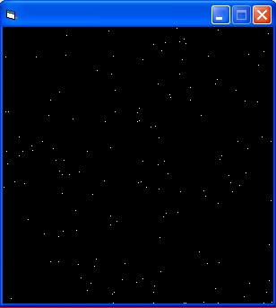



## Moving Stars\. Tutorial\. Graphics\. Includes Image

### Description

This articles makes moving stars. It could be used to create a star shooting game. For beginners.

PLEASE VOTE

PLEASE COMMENT
 
### More Info
 

             |
---                |---
**Submitted On**   |
**By**             |[Rodrigo Bolaños](https://github.com/Planet-Source-Code/PSCIndex/blob/master/ByAuthor/rodrigo-bola-os.md)
**Level**          |Beginner
**User Rating**    |4.5 (18 globes from 4 users)
**Compatibility**  |VB 3\.0, VB 4\.0 \(16\-bit\), VB 4\.0 \(32\-bit\), VB 5\.0, VB 6\.0, VB Script, ASP \(Active Server Pages\) , VBA MS Access, VBA MS Excel
**Category**       |[Graphics](https://github.com/Planet-Source-Code/PSCIndex/blob/master/ByCategory/graphics__1-46.md)
**World**          |[Visual Basic](https://github.com/Planet-Source-Code/PSCIndex/blob/master/ByWorld/visual-basic.md)
**Archive File**   |

### Source Code

'By Rodrigo Bolaños
 
 
'For beginners who want to learn the Pset. And
 
'the parameters that need to be use
 
 
Option Explicit
 
Dim Px(1 To 150) 'Pixel X position
 
Dim Py(1 To 150) 'Pixel Y positon
 
 
Dim P_LastY(1 To 150) 'Pixel Y last position
 
Dim i As Integer ' Just for the For and Next
 
Dim a As Integer ' Just for the For and Next
 
 
 
Private Sub Form_Load()
 
Me.BackColor = vbBlack
 
 
For a = 1 To 140
 
Px(a) = Rnd * Me.ScaleWidth 'Create Random X
 
'position for the pixel
 
 
Py(a) = Rnd * Me.ScaleHeight 'Create Random Y
 
'position for the pixel
 
Next a
 
End Sub
 
 
 
Private Sub Timer1_Timer() ' This is our main
 
'control
 
 
On Error Resume Next 'Just in case theres an
 
'error
 
 
For i = 1 To 140
 
Py(i) = Py(i) + 10 ' Move the stars.
 
 
If Py(i) > Me.ScaleHeight Then Py(i) = 0 'If we
 
'have reached the bottom part of the form ,
 
'put them in the top part
 
 
 
P_LastY(i) = Py(i) - 10 Calculates where the last
 
'star we draw is.
 
 
 
Me.PSet (Px(i), P_LastY(i)), vbBlack
 
Me.PSet (Px(i), Py(i)), vbWhite 'Set our new star
 
 
 
Next i
 
End Sub
 
 
'This code made 100% made by me
 
 
'Please comment
 
'Please Vote

